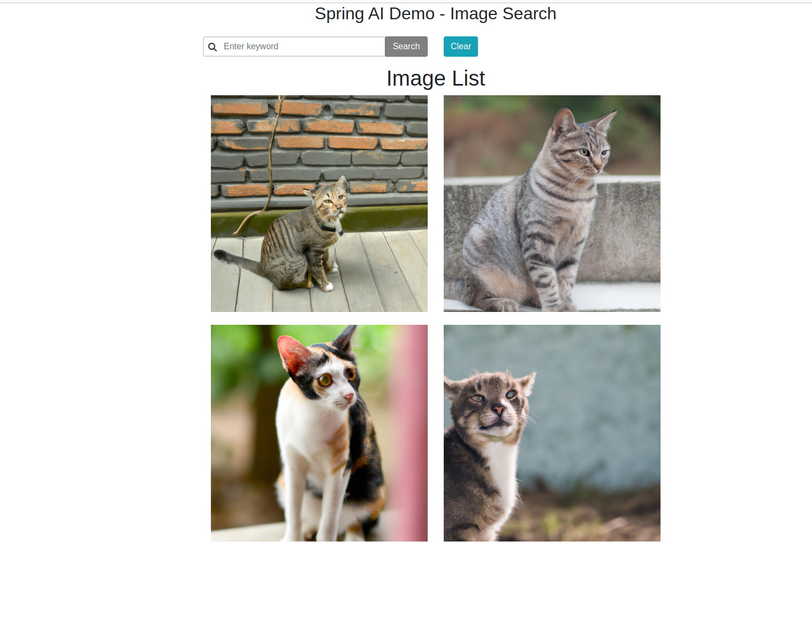

# SPRING AI DEMO





## Content

- [Tech Stack](#techstack)

- [Run](#Run)
- [Resources](#Resources)


## TechStack

- Spring Boot 3.2.3
- JAVA 17
- Spring ai
- Thymeleaf

## Run

```java
mvn spring-boot:run
```


## Resources

- [Spring AI Docs](https://docs.spring.io/spring-ai/reference/0.8-SNAPSHOT/)
- [Prompt Engineering](https://www.promptingguide.ai/)

